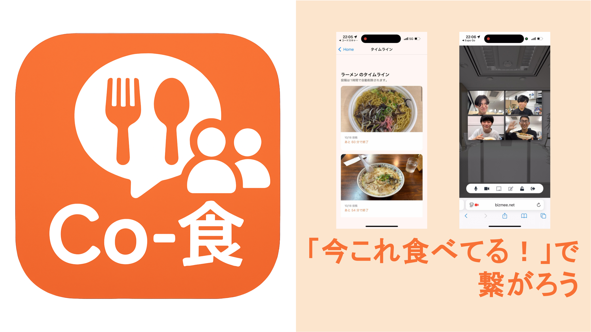

# Co-食

**Co-食**は、一人での食事に寂しさを感じる人が、
__「今」 「同じもの」__
を食べている人と食事を楽しむことができるアプリです。  
**「一緒に食事を」** という意味をこめてCo-食と名付けました。

## デモ動画

デモ動画：https://youtu.be/I2nhf73nCyQ

※動画の後半部分のアプリの操作画面は開発の途中のため、機能の名称が異なります。ご了承下さい。

## 製品概要

### 背景（製品開発のきっかけ、課題等）
**食事を楽しめてるだろうか、、、**

「かつては学校の給食の時間のように、誰かと笑い合いながら食事をしていたが、**一人暮らしを始めてから誰かと食事を共にする機会はぐっと減ってしまった**」といった経験をした人も多いのではないでしょうか。 特に夜ご飯の場合、オフラインで誰かと食事を共にしようとすると、**予定を合わせたり、移動したり**といった手間が発生し、忙しい日常の中では、時間的・金銭的制約のためになかなか実現しづらいという問題もあります。

食事の時間が孤独になると、食への関心が薄れたり、気分が落ち込みやすくなるなど、メンタルヘルスにも悪影響を及ぼすことが知られています。こうした **「孤食（こしょく）」** の問題は、一人暮らしの学生や社会人を中心に深刻化しています。

**既存ツールでは、、、**

この問題を解決するために、まず思い浮かぶのが、Zoomなどのオンラインビデオツールや、料理の写真を共有するSNSです。しかし、このようなツールでは以下の障壁があるため、孤食問題の解決には至りません。

- **Zoom**のようなビデオツールは「同じ時間に」「知り合い同士で」集まる必要があり、気軽に利用するにはハードルが少し高い

- **ランダムマッチング型のビデオサービス**は、共通の話題や興味を持つ相手と出会えるとは限らず、食事を楽しむ空気感をつくるのが難しい

- **料理SNS**は、投稿を通じた交流はできても、リアルタイム性が乏しく、「今この瞬間を誰かと共有する」という体験にはつながりにくい

つまり、 **「リアルタイムに誰かとつながる」** ことと **「気軽さ・共通点のあるつながり」** を両立するという孤食を解決するための仕組みが、まだ十分に存在していません。
　

そこで私たちは、「もっと気軽に、共通の話題をきっかけに、誰かと食事を共有できる場があればいいのに」という思いから、**リアルタイムに“ゆるく”つながれる**共食体験アプリ「Co-食」を開発しました。

***

### 特長
#### 1. “今”食べている人とつながる
孤食の本質は一人で食べている今この瞬間の孤独感です。今まさに食事中の人だけがつながれる**リアルタイム性**により、遠く離れた場所にいる人とでも確かに一緒に食事している温かみを感じることができます。

#### 2. “同じ”食べ物でつながる
食事の写真を投稿すると、**同じ料理カテゴリで投稿した人同士でつながります**。たとえ離れた場所でも、「同じものを食べている人がいる！」という偶然で不思議なつながりを感じることができます。初めて出会う人とでも、同じ食べ物という共通の話題で盛り上がれます。

#### 3. 匿名で“ゆるく”つながる
既存のSNSでも単に繋がることは可能ですが、常に監視されるプレッシャーや今後の継続的なコミュニケーションなど、人間関係の煩わしさを感じることがあります。居酒屋のカウンターで隣の人と自然に盛り上がれるように、みんなで楽しく食事をするのに継続的なつながりは不要です。**一期一会の食事**を楽しみましょう。

### 製品説明（具体的な製品の説明）

1. **写真投稿**: ユーザーは食事の直前に写真を撮影し、料理のカテゴリ(ラーメン、カレーなど)を選択して投稿します。投稿後、1時間のみ「みんなの一皿」と「わいわい食堂」の機能が解放されます。
2. **みんなの一皿**: 1時間以内に同じメニューを食べている他のユーザーの食事写真が表示されます。「今、たくさんの人が私と同じものを食べている！」という共感により、今日の食事に一体感を与えます。
3. **わいわい食堂**: 料理のカテゴリに基づきユーザーが自動でグループ化され、オンライン会議のように会話しながら食事を楽しめます。接続前に「会話の種」が提案されるので、初めての相手でも安心です。料理のカテゴリに沿って会話の種が提案され、共通の話題で盛り上がることができます。
4. **マイページ**: ユーザーが過去30日間に選択した食事カテゴリのデータを収集しています。詳細な機能は今後の展望を参照してください。

### 解決出来ること
**メンタルケア**: 孤独を感じている人や食事に楽しみを見いだせない人の精神的な改善を支援します。  
**健康的な食生活への貢献**: 食事の楽しさを再発見することで、自炊意欲や多様な食事習慣の獲得につながります。

### 今後の展望
- **投稿機能**  
現在の投稿機能では写真を撮影するときに「アルバムから選択」ができてしまうため、リアルタイム性が厳密には保証されていません。（昔撮ったご飯の写真をアップロードできてしまうなど。）また、カテゴリの選択もユーザーが任意選択できるため、実際に同じ食事を食べているかどうかが厳密には制限されていません。（本当はカレーを食べているのに、ラーメンボタンを選択できてしまうなど。）今後は、今同じものを食べていることが確実に保証されるような機能の実装を検討しています。具体的には、アルバムから写真を選択できる機能の削除、撮影した料理画像を自動認識してカテゴリが選択される機能の実装などを検討しています。

- **マイページ**    
現在、マイページ機能でユーザーの過去30日分の食事カテゴリのデータが収集できます。「こしょく」には孤食のほかにも、普段の食事が固定化される「固食」や1回の食事量が少ない「小食」といった問題があり、ユーザーの食事データを活用することでこれらの問題を解消できる可能性があります。現段階では、最近食べていない食事のカテゴリを提案する機能を実装しています。この機能は孤食の解消という本来の目的から外れるためメインの機能としませんでしたが、このデータの有効な活用法について今後検討していきたいと考えています。

### 注力したこと（こだわり等）
既存の SNS や一般的なオンライン会議ツールとの差別化に最も注力しました。

* **「同じ食事カテゴリ」によるマッチング**: 「誰かと話す」ではなく、「同じものを食べている仲間と話す」状況を作り、会話の障壁を下げました。
* **「今」に特化した体験設計**: タイムラインやオンライン通話を利用するには直近の食事写真投稿を必須とし、リアルタイム性と鮮度を担保しました。

---

## 開発技術
### 活用した技術

#### API・データ
- **Firebase**: Authentication / Cloud Firestore / Cloud Storage / Analytics / Cloud Functions（Firestore Trigger・HTTPS Callable）
- **Supabase**: Storage API
- **外部サービス**: BizMee ルーム URL（カテゴリ別オンライン食卓リンク）

#### フレームワーク・ライブラリ・モジュール
- **アプリ基盤**: Expo（React Native / React 19）、React Navigation
- **デバイス・UI連携**: Expo AV / Camera / Image Picker / Linear Gradient / Status Bar、Async Storage、Safe Area Context、Screens、URL Polyfill
- **BaaS SDK**: Firebase クライアント SDK、Supabase JS SDK（firebase-admin / firebase-functions 含む）
- **言語・ツール**: TypeScript

#### デバイス
- iOS / Android

#### 動作確認
- （確認した端末や手順があれば記載）

---

## 独自技術
### ハッカソンで開発した独自機能・技術
- 独自機能の内容をここに記載してください。
- 特に力を入れた部分はファイルパスや commit ID も併記すると共有がスムーズです。
